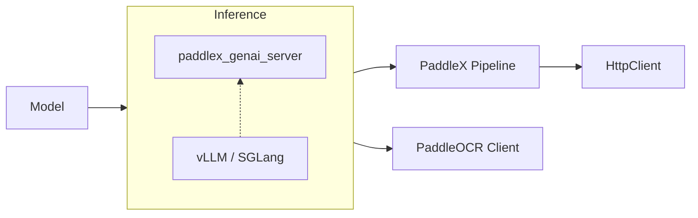

# PaddleOCR-VL

[PaddleOCR-VL Doc](https://www.paddleocr.ai/latest/version3.x/pipeline_usage/PaddleOCR-VL.html)

[PaddleX Doc](https://paddlepaddle.github.io/PaddleX/latest/pipeline_usage/tutorials/ocr_pipelines/PaddleOCR-VL.html)

## Architecture



## Inference with vLLM & SGLang
Set vLLM configuration: 
```yaml title="vllm_config.yaml"
gpu-memory-utilization: 0.8
max-num-seqs: 1024
max_num_batched_tokens: 1024
```
```shell
docker run \
    -it \
    --rm \
    --gpus all \
    --network host \
    -v ./vllm_config.yaml:/app/vllm_config.yaml \
    ccr-2vdh3abv-pub.cnc.bj.baidubce.com/paddlepaddle/paddlex-genai-vllm-server \
    paddlex_genai_server \
    --model_name PaddleOCR-VL-0.9B \
    --host 0.0.0.0 \
    --port 8118 \
    --backend vllm \
    --backend_config /app/vllm_config.yaml
```

:::tip
Change `--backend sglang` to use SGLang.
:::

## Run PaddleX Server
### Docker
```shell
docker run --gpus all \
    --name paddlex \
    -v $PWD:/paddle  \
    --shm-size=8G \
    --network=host \
    -it \
    ccr-2vdh3abv-pub.cnc.bj.baidubce.com/paddlepaddle/paddle:3.0.0-gpu-cuda12.6-cudnn9.5-trt10.5 \
    /bin/bash
```

### CLI
Install dependencies:
```shell
python -m pip install paddlepaddle-gpu==3.2.0 -i https://www.paddlepaddle.org.cn/packages/stable/cu126/
python -m pip install paddlex
python -m pip install https://paddle-whl.bj.bcebos.com/nightly/cu126/safetensors/safetensors-0.6.2.dev0-cp38-abi3-linux_x86_64.whl

paddlex --install serving
```
Configure pipeline: 
```shell
# Get pipeline config file
paddlex --get_pipeline_config PaddleOCR-VL
```
```yaml title="PaddleOCR-VL.yaml"
# Change the backend and server_url to your own.
VLRecognition:
  genai_config:
    # hl
    backend: vllm
    # hl
    server_url: http://127.0.0.1:8118
```
Run server:
```shell
paddlex --serve --pipeline PaddleOCR-VL
# or specific pipeline config file
paddlex --serve --pipeline PaddleOCR-VL.yaml
```
[API Doc](https://paddlepaddle.github.io/PaddleX/latest/pipeline_usage/tutorials/ocr_pipelines/PaddleOCR-VL.html#43)