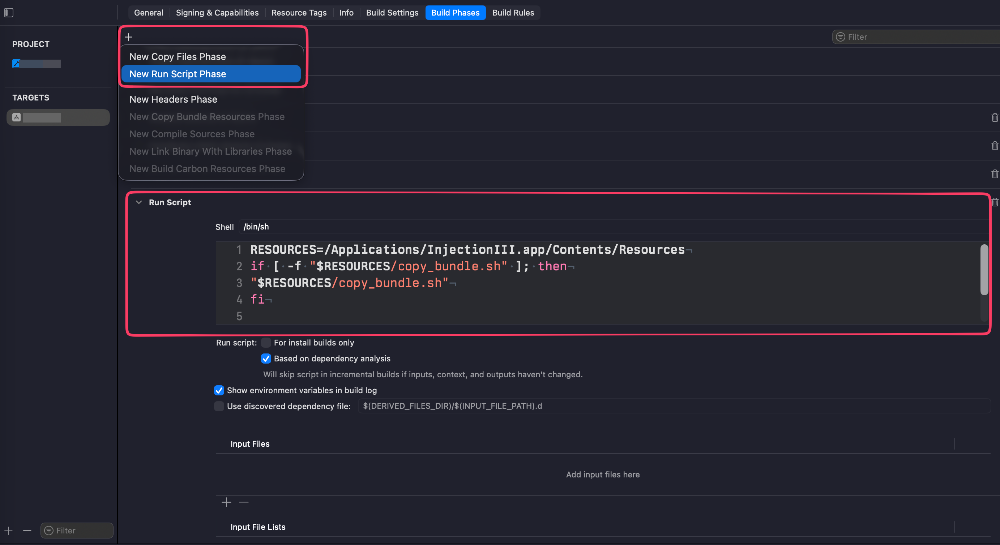

# Configure SwiftUI Hot Reload

## Syntax highlight & code completion

Install Zed swift extension

Install [xcode-build-server](https://github.com/SolaWing/xcode-build-server)

```shell
brew install xcode-build-server
```

Run in the project root dir, will generate `buildServer.json`:

```shell
xcode-build-server config -scheme <Project Scheme>
```

Install [InjectionIII](https://github.com/johnno1962/InjectionIII)

## InjectionIII settings

Xcode project settings:

`Build Settings -> All -> Linking-General -> Other Linker Flags` add `-Xlinker  -interposable`


If >= Xcode 16.3, add User-Defined Setting `EMIT_FRONTEND_COMMAND_LINES` to `YES`, **only in `Debug` is enough**


If run on a real device, such as a macOS app,

- Turn off `App Sandbox` and `Hardened Runtime` in `Signing & Capabilities`
  

- Set `User Script Sandboxing` to `NO` in Build Settings
  

  :::warning
  Remember to turn on the above two when on release
  :::

  - Add Scripts in Build Phases
    
      ```shell
      RESOURCES=/Applications/InjectionIII.app/Contents/Resources
      if [ -f "$RESOURCES/copy_bundle.sh" ]; then
      "$RESOURCES/copy_bundle.sh"
      fi
      ```

    - Add the code blew in App init method
        ```swift
        @main
        struct testApp: App {
        // adds
            init() {
                #if DEBUG
                Bundle(path: "/Applications/InjectionIII.app/Contents/Resources/iOSInjection.bundle")?.load()
                //for tvOS:
                Bundle(path: "/Applications/InjectionIII.app/Contents/Resources/tvOSInjection.bundle")?.load()
                //Or for macOS:
                Bundle(path: "/Applications/InjectionIII.app/Contents/Resources/macOSInjection.bundle")?.load()
                #endif
            }
        // adde

            var body: some Scene {
                WindowGroup {
                    ContentView()
                }
            }
        }

    ```

## Develop SwiftUI App in other Editors
### `xcodebuild` command line
[Reference](https://swiftlogic.io/posts/run-xcode-projects-from-cli/)
```shell
// list project infomation
xcodebuild -list -project <Project Name>.xcodeproj

// build project debug
xcodebuild -scheme <Project Scheme> -configuration Debug

// run unit test
xcodebuild test -scheme <Project Scheme> -configuration Debug

// run unit test without build
xcodebuild test-without-building -scheme <Project Scheme>
```

### Zed
```json title="tasks.json"
[
    {
        "label": "Xcode Build & Run",
        "command": "xcodebuild -scheme note-test -configuration Debug && open $(xcodebuild -scheme note-test -configuration Debug -showBuildSettings 2>/dev/null | grep -m 1 CONFIGURATION_BUILD_DIR | sed 's/.*= //')/note-test.app",
        "use_new_terminal": false,
        "reveal": "no_focus"
    },
    {
        "label": "Xcode Build (Debug)",
        "command": "xcodebuild -scheme note-test -configuration Debug",
        "use_new_terminal": false,
        "reveal": "no_focus"
    },
    {
        "label": "Xcode Run",
        "command": "open $(xcodebuild -scheme note-test -configuration Debug -showBuildSettings 2>/dev/null | grep -m 1 CONFIGURATION_BUILD_DIR | sed 's/.*= //')/note-test.app",
        "use_new_terminal": false,
        "reveal": "no_focus"
    },
    {
        "label": "Xcode Stop",
        "command": "pkill -x $(xcodebuild -scheme note-test -configuration Debug -showBuildSettings 2>/dev/null | grep '^ *PRODUCT_NAME =' | sed 's/.*= //')",
        "use_new_terminal": false,
        "reveal": "no_focus"
    },
    {
        "label": "Xcode Test",
        "command": "swift test",
        "use_new_terminal": false,
        "reveal": "no_focus"
    }
]

```

### Jetbrains
WIP
