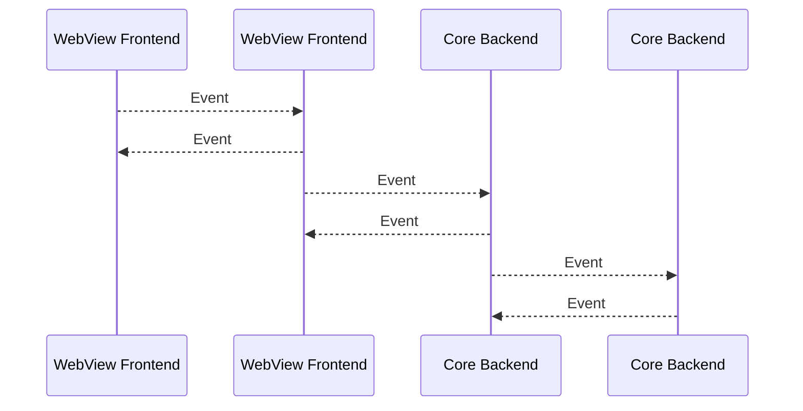

# Event
[Related tauri docs](https://tauri.app/develop/calling-frontend/#event-system)



- The event system was designed for situations where small amounts of data need to be streamed or you need to implement a multi consumer multi producer pattern (e.g. push notification system).
- The event system is not designed for low latency or high throughput situations. See the channels section for the implementation optimized for streaming data.
- Events are fire-and-forget, one-way IPC messages that are best suited to communicate lifecycle events and state changes. Unlike Commands, Events can be emitted by both the Frontend and the Tauri Core.
- Unlike commands, events are not type safe, are always async, cannot return values and only supports JSON payloads.

---

Events has two types: Global Events and WebView Event.
## Emit Events from frontend
### Global Events
Global events are delivered to all listeners.
```typescript
import { emit } from '@tauri-apps/api/event';
import { getCurrentWebviewWindow } from '@tauri-apps/api/webviewWindow';

// emit(eventName, payload)
// Emits an event to all targets
emit('file-selected', '/path/to/file');

// Emits an event to targets matching the given target.
const appWebview = getCurrentWebviewWindow();
appWebview.emit('route-changed', { url: window.location.href });
```
### WebView Event
Emit an event to a listener registered by a specific webview.
```typescript
import { emitTo } from '@tauri-apps/api/event';
import { getCurrentWebviewWindow } from '@tauri-apps/api/webviewWindow';

// emitTo(webviewLabel, eventName, payload)
emitTo('settings', 'settings-update-requested', {
  key: 'notification',
  value: 'all',
});

// Emits an event to targets matching the given target.
const appWebview = getCurrentWebviewWindow();
appWebview.emitTo('editor', 'file-changed', {
  path: '/path/to/file',
  contents: 'file contents',
});
```

## Listen to Events in frontend
### Global Events
```typescript
import { listen } from '@tauri-apps/api/event';

type DownloadStarted = {
  url: string;
  downloadId: number;
  contentLength: number;
};

listen<DownloadStarted>('download-started', (event) => {
  console.log(
    `downloading ${event.payload.contentLength} bytes from ${event.payload.url}`
  );
});
```

### WebView Event
```typescript
import { getCurrentWebviewWindow } from '@tauri-apps/api/webviewWindow';

const appWebview = getCurrentWebviewWindow();
appWebview.listen<string>('logged-in', (event) => {
  localStorage.setItem('session-token', event.payload);
});
```
To listen to any event you must provide the `{ target: { kind: 'Any' } }` option to the `event.listen` function:
```typescript
import { listen } from '@tauri-apps/api/event';
listen(
  'state-changed',
  (event) => {
    console.log('got state changed event', event);
  },
    // hls
  {
    target: { kind: 'Any' },
  }
  // hle
);
```

:::warning
In Tauri events, **_if you emit an event before setting up a listener, the event data will be lost_**.
Tauri's event system works on a publish-subscribe pattern where events are dispatched immediately when emitted. If no listeners are registered at the time of emission, the event simply gets discarded - there's no built-in queuing or buffering mechanism.

Some common solutions to handle this timing issue can refer to [this section](./event#event-listening-order)
:::

### Remember to `unlisten`
The `listen` function keeps the event listener registered for the **_entire lifetime_** of the application. To stop listening on an event you can use the unlisten function which is returned by the listen function:
```typescript
import { listen } from '@tauri-apps/api/event';

const unlisten = await listen('download-started', (event) => {});
unlisten();
```
:::note
Always use the `unlisten` function when your execution context goes out of scope such as when a component is unmounted.

When the page is reloaded or you navigate to another URL the listeners are unregistered automatically. This does not apply to a Single Page Application (SPA) router though.
:::
Additionally Tauri provides a utility function for listening to an event exactly once:
```typescript
import { once } from '@tauri-apps/api/event';
import { getCurrentWebviewWindow } from '@tauri-apps/api/webviewWindow';

once('ready', (event) => {});

const appWebview = getCurrentWebviewWindow();
appWebview.once('ready', () => {});
```

## Emit Events from rust
### Global Events
```rust
use tauri::{AppHandle, Emitter};

#[tauri::command]
fn download(app: AppHandle, url: String) {
  app.emit("download-started", &url).unwrap();
  for progress in [1, 15, 50, 80, 100] {
    app.emit("download-progress", progress).unwrap();
  }
  app.emit("download-finished", &url).unwrap();
}
```
### WebView Event
```rust
use tauri::{AppHandle, Emitter};

#[tauri::command]
fn login(app: AppHandle, user: String, password: String) {
  let authenticated = user == "tauri-apps" && password == "tauri";
  let result = if authenticated { "loggedIn" } else { "invalidCredentials" };
  app.emit_to("login", "login-result", result).unwrap();
}
```
It is also possible to trigger an event to a list of webviews by calling Emitter#emit_filter:
```rust
use tauri::{AppHandle, Emitter, EventTarget};

#[tauri::command]
fn open_file(app: AppHandle, path: std::path::PathBuf) {
  app.emit_filter("open-file", path, |target| match target {
    EventTarget::WebviewWindow { label } => label == "main" || label == "file-viewer",
    _ => false,
  }).unwrap();
}
```
### Event Payload
The event payload can be any serializable type that also implements `Clone`.
```rust
app.emit("download-started", DownloadStarted {
    url: &url,
    download_id,
    content_length
  }).unwrap();
```

## Listen to Events in rust
### Global Events
```rust
use tauri::Listener;

#[cfg_attr(mobile, tauri::mobile_entry_point)]
pub fn run() {
  tauri::Builder::default()
    .setup(|app| {
      app.listen("download-started", |event| {
        if let Ok(payload) = serde_json::from_str::<DownloadStarted>(&event.payload()) {
          println!("downloading {}", payload.url);
        }
      });
      Ok(())
    })
    .run(tauri::generate_context!())
    .expect("error while running tauri application");
}
```
### WebView Event
```rust
use tauri::{Listener, Manager};

#[cfg_attr(mobile, tauri::mobile_entry_point)]
pub fn run() {
  tauri::Builder::default()
    .setup(|app| {
      let webview = app.get_webview_window("main").unwrap();
      webview.listen("logged-in", |event| {
        let session_token = event.data;
        // save token..
      });
      Ok(())
    })
    .run(tauri::generate_context!())
    .expect("error while running tauri application");
}
```
Webview-specific events are not triggered to regular global event listeners. To listen to any event you must use the `listen_any` function instead of `listen`, which defines the listener to act as a catch-all for emitted events.
### Remember to `unlisten`
```rust
// unlisten outside of the event handler scope:
let event_id = app.listen("download-started", |event| {});
app.unlisten(event_id);

// unlisten when some event criteria is matched
let handle = app.handle().clone();
app.listen("status-changed", |event| {
  if event.data == "ready" {
    handle.unlisten(event.id);
  }
});
```
Listen only once:
```rust
app.once("ready", |event| {
  println!("app is ready");
});
```

## Event listening order
In Tauri events, **_if you emit an event before setting up a listener, the event data will be lost_**. 
Tauri's event system works on a publish-subscribe pattern where events are dispatched immediately when emitted. If no listeners are registered at the time of emission, the event simply gets discarded-there's no built-in queuing or buffering mechanism.

Some common solutions to handle this timing issue listed below.

Working in progress...
